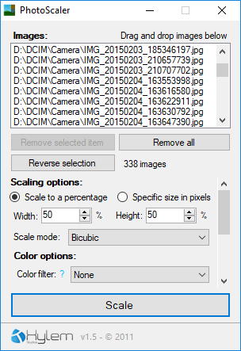

# PhotoScaler

>  **Please note**: This codebase is old as *fuck*. I mean it. I might get around to cleaning it, but for now, enjoy the unedited code in all it's glory. [Learn more](https://github.com/xylemstudios/status)

Simple batch image resizer.

PhotoScaler was made to suit my personal needs, so there's some quirks and missing features.

## Features

- Simple drag-and-drop GUI
- Choose scale mode (bicubic, bilinear, high speed, nearest-neighbour)
- Apply filters to the scaled images
- Batch rotate and flip

## Contributing

Code contributions are welcome! Don't hesitate to make a pull request. Please note however that the project is currently not maintained.

You can follow everything from the dedicated [status repository](https://github.com/xylemstudios/status).

## License

This project and it's associated source code and files are licensed under the [GNU General Public License 3.0](LICENSE).